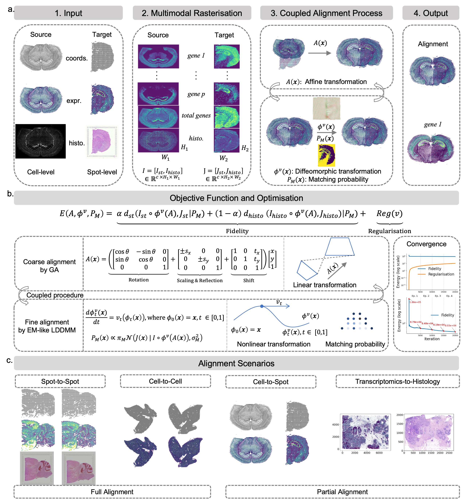

# GALA
A Unified Landmark-Free Framework for Coarse-to-Fine Spatial Alignment Across Resolutions and Modalities in Spatial Transcriptomics
=======


# Pipeline of GALA and its application scenarios


-  **(a)** GALA takes as input a ***source*** dataset (to be aligned) and a ***target*** dataset, both multimodal and integrating spatial coordinates (`coords`), gene expression (`expr`), and histological images (`histo`). They differ in resolution: the source is at cellular/subcellular (cell-level) and the target at multicellular (spot-level) resolution. To enable joint processing, both datasets are rasterized into multi-channel tensors, $I \in \mathbb{R}^{c \times H_1 \times W_1}$ and $J \in \mathbb{R}^{c \times H_2 \times W_2}$, with $c = p + 2$ determined by input modalities.  A coupled optimisation under a unified objective $$E(A,v)=\text{Fidelity}(A,v)+\text{Reg}(v)$$ 
iteratively estimates the global affine transformation $A(x)$ and refines the local diffeomorphic deformation $\phi^v(A(x))$. During fine alignment, $P_M(x)$ represents the probability that a target location $x \in \mathbb{R}^2$ corresponds to the source. The alignment of a representative informative gene is also shown.

- **(b)** Schematic representation of the unified objective function and the coupled optimisation scheme, together with a convergence illustration. The global stage estimates the affine transformation matrix via a GA, corresponding to a linear mapping. The local stage jointly estimates the diffeomorphic deformation and matching probabilities through an expectation maximization(EM)-like LDDMM procedure, representing a nonlinear transformation guided by a Gaussian posterior.

- **(c)** GALA applies broadly across diverse alignment tasks, including same-modality alignment at matched or mismatched resolutions (spot-to-spot, cell-to-cell, or cell-to-spot/spot-to-cell) and cross-modality alignment (e.g., transcriptomics-to-histology at different scales). It also supports both full and partial alignment.

# Tutorials
- Spot-to-spot alignment of DLPFC data. (See [tutorial1](tutorials/tutorial1.html))
- Spot-to-spot alignment of DLPFC data (partial alignment). (See [tutorial3](tutorials/tutorial2.html))
- Spot-to-spot alignment of MBSP data. (See [tutorial3](tutorials/tutorial3.html))
- Cell-to-cell alignment of mouse liver replicates. (See [tutorial4](tutorials/tutorial4.html))
- Cell-to-spot alignment of mouse brain coronal sections (partial alignment). (See [tutorial5](tutorials/tutorial5.html))
- Transcriptomics-to-Histology alignment of human breast and lung cancers (partial alignment). (See [tutorial6](tutorials/tutorial6.html))


# Installation
Users need to create an environment and install GALA by following procedures:
```
conda create -n gala_env python=3.12.9
conda activate gala_env

```

